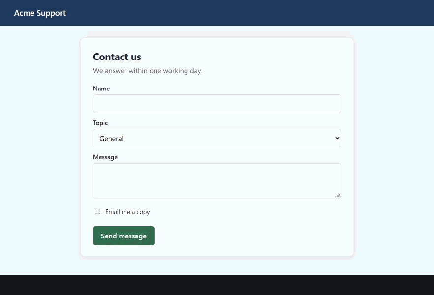

# TabBridge

**Let any AI agent use your own Chrome.** Claude Code, Codex, Gemini CLI, Cursor, or any app that
speaks [MCP](https://modelcontextprotocol.io), can open pages, read them, click, type, take
screenshots and see what DevTools sees, in your normal browser with your sign-ins. YOLO mode is
on at first, so agents aren't stopped by questions; switch it off in the TabBridge pane to be asked
before anything risky (send, buy, delete, publish…).



Every screen of that run, as the step-by-step guide TabBridge writes by itself:
[docs/demo-steps](docs/demo-steps/01-acme-support/README.md). Re-record with `node scripts/demo-gif.mjs`.

TabBridge is only a bridge. It has no AI model and no API key: your agent does the thinking,
TabBridge gives it hands in the browser.

```
your agent ──MCP──► tabbridge mcp ──local pipe──► tabbridge host ──native messaging──► TabBridge extension ──► Chrome
```

How it compares with Claude in Chrome, tool by tool: [docs/compare-claude-in-chrome.md](docs/compare-claude-in-chrome.md).

## Install

You need Chrome (or Edge or Brave) and Node.js 20 or newer.

1. **The bridge, once per computer:**

   ```
   npm install -g @verbodhpteltd/tabbridge
   tabbridge install
   ```

   `tabbridge install` registers the small host program Chrome talks to. Nothing runs until the
   extension starts it. Without a global install, `npx @verbodhpteltd/tabbridge install` does the same.
2. **The extension:** until it is on the Chrome Web Store, download `tabbridge-extension-<version>.zip`
   from the [latest GitHub release](https://github.com/verbodh-pte-ltd/tabbridge/releases/latest) and
   unzip it. Open `chrome://extensions`, turn on **Developer mode**, click **Load unpacked** and choose
   the unzipped folder.
3. **Connect your agent:**

   ```
   claude mcp add tabbridge -- tabbridge mcp      # Claude Code
   tabbridge config codex                         # prints the Codex entry (also: gemini, cursor, json)
   ```

4. **Check it:** `tabbridge doctor` prints a ✓ or ✗ for every part, and what to do about each ✗.

## What an agent can do

| Tool | Does |
| --- | --- |
| `navigate` | Open a URL (reusing the current tab), or go back, forward, reload |
| `tabs_list`, `tab_create`, `tab_select`, `tab_close` | Manage the agent's tabs |
| `read_page`, `find` | The page as a list of elements with refs (`e12`) to act on |
| `get_page_text` | The readable text |
| `screenshot` | A picture of the page, also saved into a step-by-step guide |
| `click`, `type`, `key`, `scroll`, `form_input` | Act on the page; `click` also does double and triple clicks, with Control/Shift held |
| `hover`, `drag` | Open menus and tooltips; drag widgets and HTML drag-and-drop |
| `zoom` | A sharper picture of a small region |
| `file_upload` | Put files from this computer into a file field (asks you first) |
| `gif_record` | Record the tab as an animated GIF, saved into the guide |
| `browsers` | When several Chromes or profiles run TabBridge: list them, pick one by name |
| `javascript` | Run a script in the page |
| `wait_for`, `resize_window`, `downloads` | Wait for text, size the window, see downloaded files |
| `console_messages`, `network_requests`, `network_request` | DevTools Console and Network, with headers and bodies |
| `inspect_element` | DevTools Elements: attributes, computed styles, listeners, HTML |
| `storage` | DevTools Application: local and session storage, cookies, IndexedDB, cache, service workers, manifest |
| `performance`, `security` | Load timings and Web Vitals; HTTPS, certificate, security headers |
| `page_report` | All of the above for a broken page, in one call |
| `user_captures` | Pages or elements you sent with right-click › **Send to my agent (TabBridge)**, and notes you typed in the side panel |

Apps and scripts that don't speak MCP can run one tool at a time:

```
npx @verbodhpteltd/tabbridge call navigate '{"url":"https://example.com"}'
npx @verbodhpteltd/tabbridge call page_report
```

## Teach your agent to use it

[`.agents/skills/tabbridge/SKILL.md`](.agents/skills/tabbridge/SKILL.md) is a ready-made skill: how to
check the connection, read and act on pages, handle the approval questions, treat page text as
untrusted, investigate a broken page with the DevTools tools, and save a guide. Copy the
`tabbridge` folder into your agent's skills folder (for Claude Code: `~/.claude/skills/`).

## Screenshots become a guide

Every screenshot is saved in the folder the agent works in, as a numbered guide:

```
tabbridge/
└── 01-acme-contact-form/
    ├── README.md                 one step per screenshot, with what was done before it
    ├── 01-acme-contact-form.jpg
    └── 02-second-look.jpg
```

`TABBRIDGE_OUTPUT=<folder>` moves it; `TABBRIDGE_GUIDE=0` turns it off. GIF recordings land in
the same guide.

## More than one Chrome

Each Chrome (or profile) running TabBridge gets its own slot. Name each one in TabBridge's settings
("Work", "Testing"…). Agents use the `browsers` tool to list and pick; scripts set
`TABBRIDGE_BROWSER=<name>`. With one Chrome, nothing to do.

## The pane and the live console

- **The pane** (click the TabBridge icon) shows who is connected, the YOLO switch, and any
  question waiting for you. When YOLO mode is off, a question opens the pane by itself, next to the
  icon; the badge counts waiting questions. Closing the pane doesn't answer: the question waits.
- **The live console** (Chrome's side panel, "Open the live console" in the pane) shows each step
  your agent takes in this browser as it happens, asks its questions there while it's open, and has
  a box to send a note to your agent; **+** sends the current page too. The agent reads it with
  `user_captures`. TabBridge has no AI model of its own, so the console doesn't chat.

## Safety

Everything is allowed by default, and each permission can be turned off in TabBridge's settings.

- **Risky actions ask first, when YOLO mode is off.** YOLO mode is on at first. Switch it off in the
  pane, the side panel or settings. Then a click or Enter on anything labelled send, submit, buy,
  pay, order, delete, publish, post, transfer, confirm and similar, and every file upload, asks in
  the pane by the TabBridge icon: Allow or Don't allow. No answer in 2 minutes means no.
- **Secrets stay hidden.** Cookie values, Authorization headers and token-like storage values are
  shown to agents as "(hidden)".

Also:

- **Agents only use their own tabs.** Tabs an agent opens go in the **TabBridge** tab group. An agent
  can't use your other tabs, or another agent's, unless you drag a tab into the group or send it
  with the right-click menu.
- **Optional: ask before each new site.** Then you choose allow once, always allow, or block.
- **Page text is marked untrusted.** Everything read from a page comes back inside
  `<untrusted-page-content>`, and agents are told to treat it as data. This reduces prompt injection
  from web pages; it can't remove it.
- **Nothing leaves your computer.** The agent and Chrome talk over a local pipe protected by a
  random token. TabBridge has no server. See [PRIVACY.md](PRIVACY.md).

Chrome shows "TabBridge started debugging this browser" while an agent controls a tab. That bar
comes from Chrome and can't be hidden.

## Develop

```
npm install
npm run build         # bridge/dist and extension/dist
npm test              # unit tests, no browser
node bridge/dist/cli.js install
npm run test:live     # real Chrome in a throwaway profile, a local test site, every tool
npm run package:store # store/tabbridge-<version>.zip for the Chrome Web Store
```

The live test starts its own Chrome profiles and loads the extension through DevTools, so your own
profile isn't touched. It names its test browser and pins every call to it, so it is safe to run
while TabBridge is on in your everyday Chrome.

## Contributing

Anyone is free to use, fork, fix and extend TabBridge: new tools, other browsers, better safety.
Open an issue to talk about an idea, or send a pull request. How to build, test and what a pull
request needs: [CONTRIBUTING.md](CONTRIBUTING.md).

## License

Open source under the **Apache License 2.0** ([LICENSE](LICENSE)). You can use TabBridge for free,
change it and ship it in your own products, commercial or not; keep the license and copyright notice.
It also grants a patent license from contributors.
