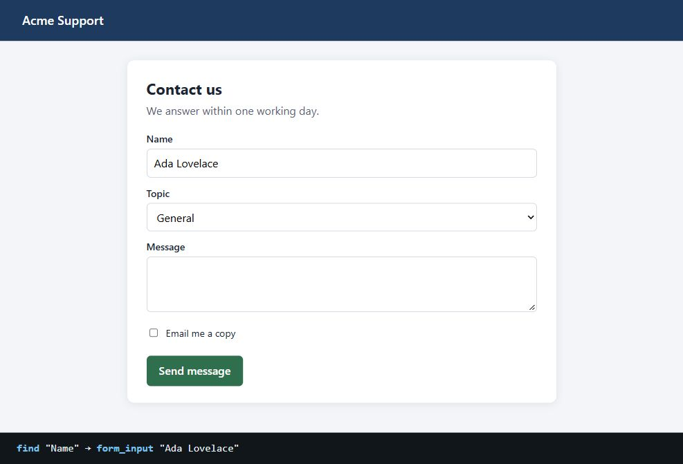
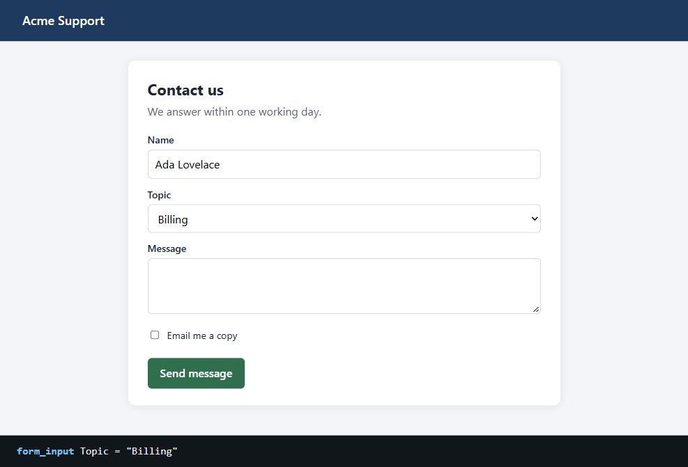
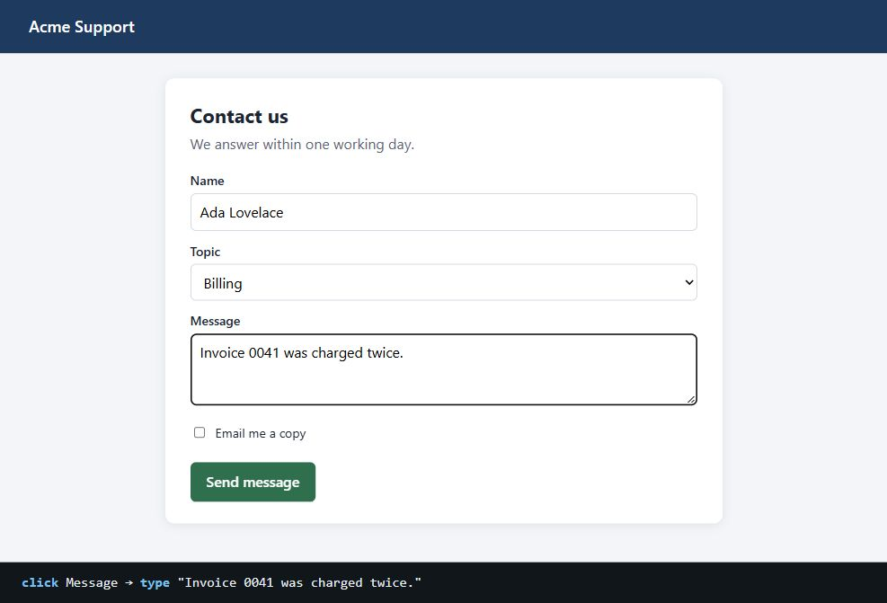
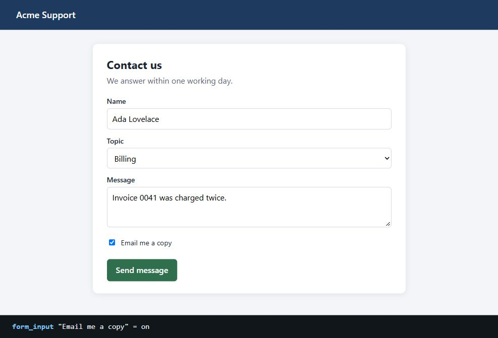
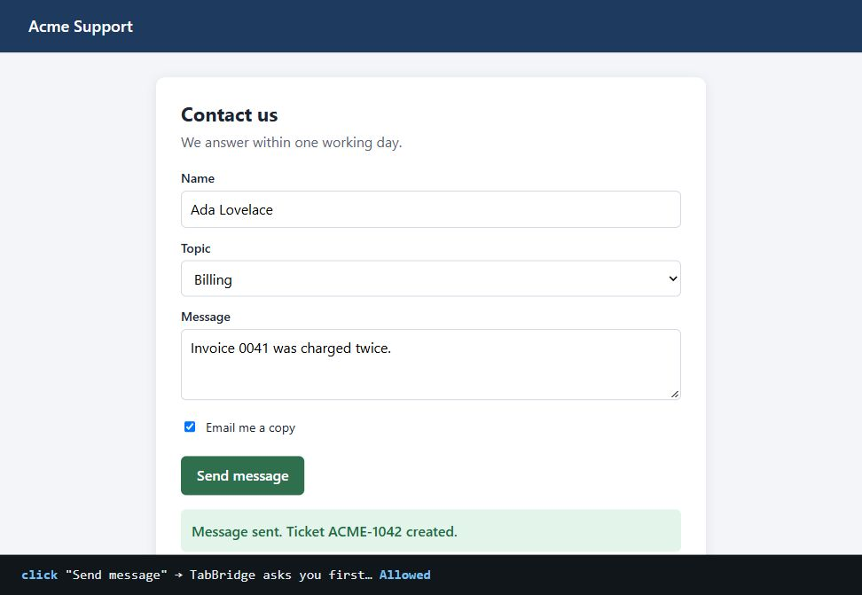
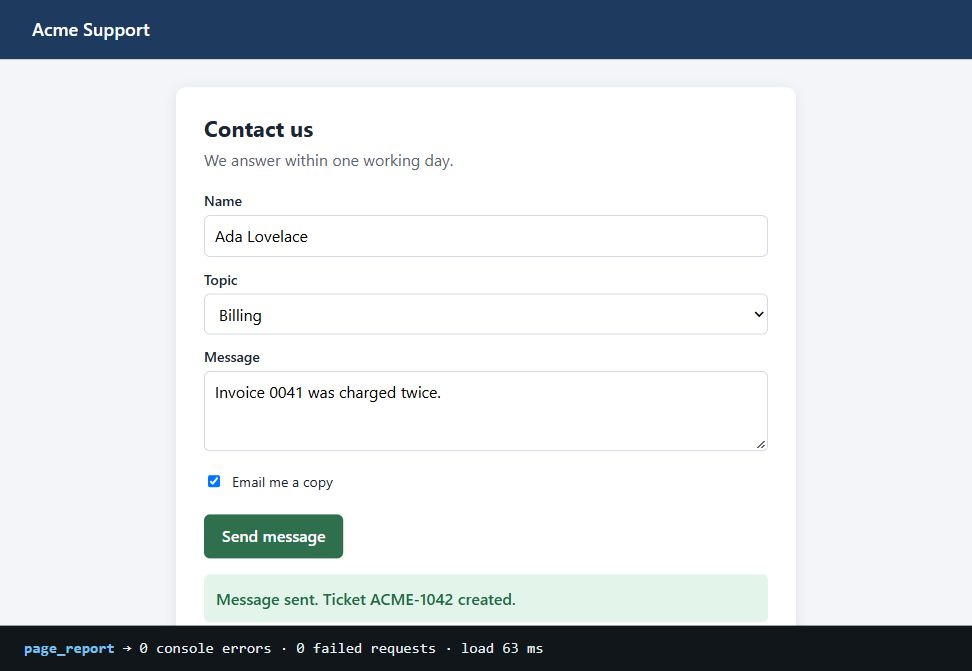

# Acme Support

<!-- tabbridge guide, client: claude-code -->
Recorded by TabBridge on 2026-10-06 17:07, driven by claude-code. One step per screenshot, in order.

## Step 1: The support form opens

- Opened http://127.0.0.1:58934/support
- Resized the window to 1000×820
- Started recording

Page: Acme Support — http://127.0.0.1:58934/support

## Step 2: Name filled in

- Set "Name" to "Ada Lovelace"

Page: Acme Support — http://127.0.0.1:58934/support

## Step 3: Topic set to Billing

- Set "Topic" to "Billing"

Page: Acme Support — http://127.0.0.1:58934/support

## Step 4: Message typed

- Clicked textbox "Message"
- Typed 32 characters

Page: Acme Support — http://127.0.0.1:58934/support

## Step 5: Copy by email ticked

- "Email me a copy" is now checked

Page: Acme Support — http://127.0.0.1:58934/support

## Step 6: Sent after the user allowed it

- Clicked button "Send message"

Page: Acme Support — http://127.0.0.1:58934/support

## Step 7: page_report checks the page

- Checked the page with page_report

Page: Acme Support — http://127.0.0.1:58934/support

## Step 8: Demo recording

